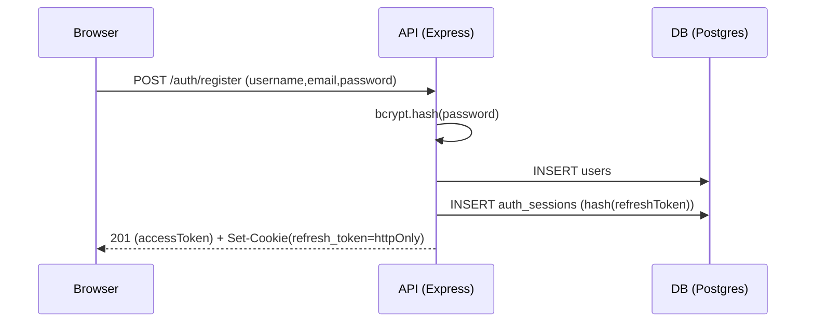
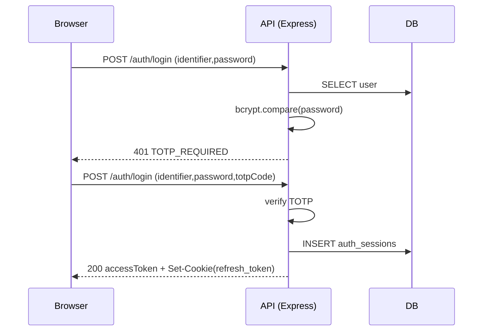
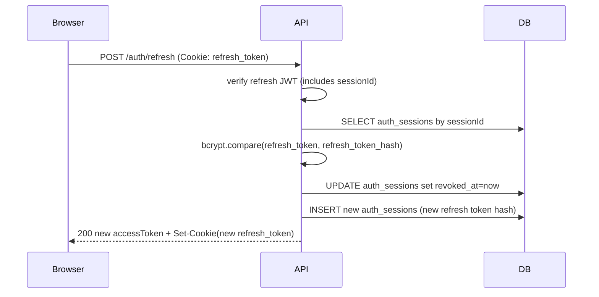

# Week 2 Auth Flow (bcrypt + TOTP + JWT access/refresh)

This repo implements a beginner-friendly but production-style authentication flow:

- **Passwords** are hashed with **bcrypt** (slow-by-design)
- **Access tokens** are **JWTs** (short-lived) stored **in memory** on the frontend
- **Refresh tokens** are **JWTs** (longer-lived) stored in an **httpOnly cookie**
- **Refresh rotation**: every `/auth/refresh` call revokes the old session and creates a new one
- Optional **TOTP 2FA** (Google Authenticator/Authy/1Password) with the secret **encrypted at rest**

> This is a scaffold for learning. For real production systems, consider WebAuthn (passkeys), a shared rate limiter (Redis/WAF), and a proper secrets/KMS strategy.

---

## Why two tokens?

### Access token (short-lived)
- Sent as `Authorization: Bearer <token>`
- Stored **only in memory** (Zustand store)
- If it’s stolen, it should expire quickly

### Refresh token (longer-lived)
- Stored as an **httpOnly cookie** (JavaScript can’t read it)
- Used only to call `/api/auth/refresh`
- Rotated on every refresh to reduce replay risk

---

## API Endpoints

Base URL: `http://localhost:5000/api`

### 1) Register
`POST /api/auth/register`

Request body:
```json
{
  "username": "alice_wonderland",
  "email": "alice@example.com",
  "displayName": "Alice Wonderland",
  "password": "Str0ngPassword!123",
  "enable2fa": false
}
```

Response (201):
```json
{
  "status": "success",
  "message": "Registered successfully",
  "data": {
    "user": {
      "id": "...",
      "username": "alice_wonderland",
      "email": "alice@example.com",
      "displayName": "Alice Wonderland",
      "totpEnabled": false
    },
    "accessToken": "eyJ..."
  }
}
```

- Sets a **refresh token cookie**: `Set-Cookie: refresh_token=...; HttpOnly; Path=/api/auth; ...`

If `enable2fa: true`, the response also includes a one-time setup payload:
```json
{
  "totpSetup": {
    "secret": "JBSWY3DPEHPK3PXP...",
    "otpauthUrl": "otpauth://totp/..."
  }
}
```

### 2) Login
`POST /api/auth/login`

Request body:
```json
{
  "identifier": "alice@example.com",
  "password": "Str0ngPassword!123",
  "totpCode": "123456"
}
```

Response (200):
```json
{
  "status": "success",
  "message": "Logged in successfully",
  "data": {
    "user": { "id": "...", "username": "...", "email": "...", "displayName": "...", "totpEnabled": true },
    "accessToken": "eyJ..."
  }
}
```

If a user has 2FA enabled and you omit `totpCode`, you’ll get:
```json
{
  "status": "error",
  "statusCode": 401,
  "message": "Two-factor authentication code required",
  "error": "Two-factor authentication code required",
  "code": "TOTP_REQUIRED"
}
```

### 3) Get current user
`GET /api/auth/me`

Headers:
```
Authorization: Bearer <accessToken>
```

Response (200):
```json
{
  "status": "success",
  "data": { "user": { "id": "...", "username": "...", "email": "..." } }
}
```

### 4) Refresh access token (and rotate refresh token)
`POST /api/auth/refresh`

- No JSON body
- Requires the browser to include cookies (`credentials: 'include'` / Axios `withCredentials: true`)

Response (200):
```json
{
  "status": "success",
  "message": "Token refreshed",
  "data": { "accessToken": "eyJ..." }
}
```

### 5) Logout
`POST /api/auth/logout`

- Revokes the current session (best-effort)
- Clears refresh cookie

---

## Password rules

The backend enforces these rules (client-side checks are UX-only):
- Minimum **12** characters
- At least one: lowercase, uppercase, number, symbol
- No spaces

---

## Sequence diagrams

### Register (auto-login)


### Login with 2FA


### Refresh rotation


---

## Troubleshooting (common beginner issues)

### “Refresh doesn’t work” / cookie not sent
- If you use `fetch`, set `credentials: 'include'`
- If you use Axios, set `withCredentials: true`
- CORS must allow credentials (backend already has `credentials: true`)

### Cookie exists but browser still doesn’t send it
- Check `SameSite` and `Secure`:
  - For localhost dev, `SameSite=Lax` typically works
  - If frontend and backend are on different *sites*, you may need `SameSite=None; Secure` (requires HTTPS)

### TOTP codes always invalid
- Make sure your system clock is correct (TOTP is time-based)
- Codes rotate every 30 seconds; don’t include spaces

### Getting 429 (rate limited)
- Login and register are rate limited to slow brute force attacks
- Wait for the `Retry-After` time and try again

---

## Demo seed users

If you ran the included seeders, demo users have password:

- `demo123`

(Seed data is for local dev only.)
